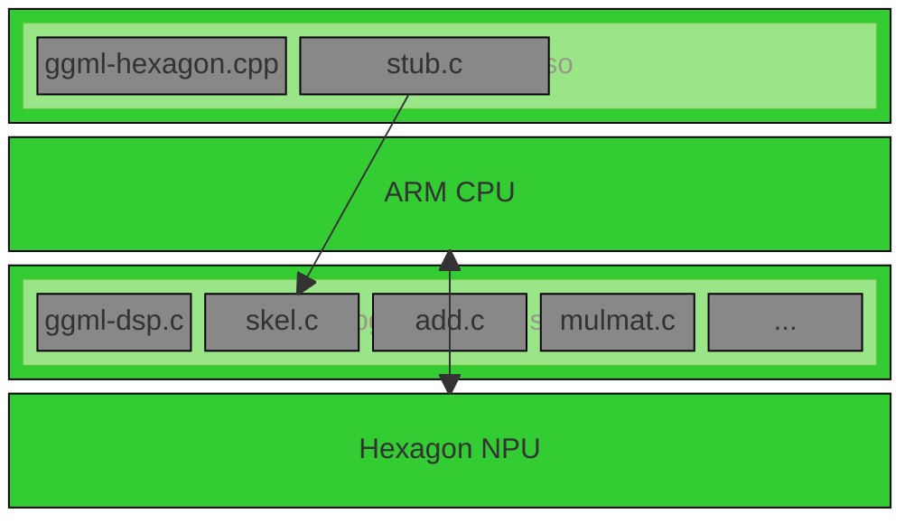

# Awesome-LLM-Inference-On-Android

##  Introduction

Focus on LLM inference on Android phone/TV/STB, especially Android phone equipped with Qualcomm Snapdragon high-end mobile SoC, such as Snapdragon 8Gen3, 8Elite, 8Elite2....

Maintain an up-to-date Github repo to track the latest development of fundamental technologies, state-of-the-art on-device LLM models, Android APPs, future directions in this rapidly evolving field.

##  Table of Contents

- [Awesome-LLM-Inference-On-Android](#awesome-llm-inference-on-android)
  - [Part 1: Research](#part-1-research)
  - [Part 2: On-Device Inference framework](#part-2-on-device-inference-framework)
  - [Part 3: Hardware acceleration](#part-3-hardware-acceleration)
  - [Part 4: Llama.cpp based Android APPs](#part-4-llamacpp-based-android-apps)
  - [Part 5: State-of-the-art on-device LLM models](#part-5-state-of-the-art-on-device-llm-models)
  - [Part 6: SoC References](#part-6-soc-references)
  - [Part 7: Acknowledgement](#part-7-acknowledgement)

## Part 1: Research
* HeteroLLM: Accelerating Large Language Model Inference on Mobile SoCs platform with Heterogeneous AI Accelerators  [[Paper]](https://arxiv.org/abs/2501.14794) 
* LLM prefilling with mllm-NPU [[Paper]](https://arxiv.org/abs/2407.05858v1)  , https://github.com/UbiquitousLearning/mllm
* PowerInfer-2: Fast Large Language Model Inference on a Smartphone  [[Paper]](https://arxiv.org/abs/2406.06282)  , https://github.com/SJTU-IPADS/PowerInfer
* T-MAC: CPU Renaissance via Table Lookup for Low-Bit LLM Deployment on Edge  [[Paper]](https://arxiv.org/abs/2407.00088v1)  , https://github.com/microsoft/T-MAC
* MobileNetV4 -- Universal Models for the Mobile Ecosystem  [[Paper]](https://arxiv.org/abs/2404.10518) 

## Part 2: On-Device Inference framework

* https://github.com/ggml-org/llama.cpp
* https://github.com/mlc-ai/mlc-llm
* https://github.com/alibaba/MNN
* https://github.com/Tencent/ncnn
* https://github.com/XiaoMi/mace
* https://github.com/OpenPPL/ppl.nn
* https://github.com/pytorch/executorch
* https://github.com/google-ai-edge/LiteRT

## Part 3: Hardware acceleration

QNN solution: aka End-to-End solution, which is similar to the Qualcomm's official AI-Hub solution.

Fig-1: cited from Qualcomm's QNN SDK Manual

llama.cpp solution: a specified ggml backend for llama.cpp on Android. Theoretically speaking, model preparation/conversion **is not needed** in this solution, which **is exactly similar to  ggml-cuda,ggml-metal,ggml-sycl**.

Fig-2: cited from Qualcomm's Hexagon SDK Programmers_Reference_Manual

libggml-hexagons.so(running on ARM CPU side):  ggml-hexagon.cpp + stub.c

libggmldsp_skel.so(running on DSP side): ggmldsp.c + skel.c + add.c + mulmat.c + ... ( developers and AI experts can operate hardware directly on DSP side)

Fig-3: self-made

QNN solution:
  - https://github.com/SJTU-IPADS/PowerInfer
  - https://github.com/UbiquitousLearning/mllm
  - https://github.com/MollySophia/rwkv-qualcomm
  - https://github.com/XiaoMi/StableDiffusionOnDevice
  - https://github.com/powerserve-project/PowerServe

llama.cpp solution:
  - https://github.com/zhouwg/ggml-hexagon, the first original llama.cpp solution which launched on 03/2024(the initial version was reverse engineered from [Qualcomm's codes in executorch](https://github.com/pytorch/executorch/tree/main/backends/qualcomm))
  - https://github.com/chraac/llama.cpp (hard-forked from zhouwg's initial version)

others:
  - https://github.com/airockchip/rknn-llm

## Part 4: Llamacpp based Android APPs
llama.cpp based Androd APPs
* https://github.com/a-ghorbani/pocketpal-ai
* https://github.com/Vali-98/ChatterUI
* https://github.com/shubham0204/SmolChat-Android
* https://github.com/kantv-ai/kantv (this is an on-device AI learning project, focus on Android OS)

## Part 5: State-of-the-art on-device LLM models

Google gemma-3n:
* gemma-3n-E4B-it-litert-preview: https://huggingface.co/google/gemma-3n-E4B-it-litert-preview
* gemma-3n-E2B-it: https://huggingface.co/google/gemma-3n-E2B-it
* gemma-3n-E4B-it: https://huggingface.co/google/gemma-3n-E4B-it
* gemma-3n-E2B-it GGUF model: https://huggingface.co/ggml-org/gemma-3n-E2B-it-GGUF/tree/main (verified on Snapdragon 8Elite)
* gemma-3n-E4B-it GGUF model: https://huggingface.co/ggml-org/gemma-3n-E4B-it-GGUF/tree/main

HuggingFace SmolVLM:
* SmolVLM-500M-Instruct:https://huggingface.co/HuggingFaceTB/SmolVLM-500M-Instruct
* SmolVLM-500M-Instruct GGUF mode: https://huggingface.co/ggml-org/SmolVLM-500M-Instruct-GGUF/tree/main (verified on Snapdragon 8Gen3 and Snapdragon 8Elite)

## Part 6: SoC References
* Qualcomm: https://docs.qualcomm.com/bundle/publicresource/topics/80-63442-50/introduction.html
* MTK: https://neuropilot.mediatek.com/resources/public/npexpress/en/docs/npexpress
* Rockchip: https://github.com/airockchip/rknn-toolkit2/
* Huawei Hisilicon: TBD
* Xiaomi Xuanjie: TBD
* Google TPU: TBD

## Part 7: Acknowledgement

 <ul>AI inference framework

   <ul>
  <li>
   <a href="https://github.com/ggml-org/ggml">GGML</a>
   </li>

  </ul>

  </ul>

 <ul>AI application engine

  <ul>
  <li>
   ASR engine <a href="https://github.com/ggml-org/whisper.cpp">whisper.cpp</a>
  </li>

   <li>
  LLM engine <a href="https://github.com/ggml-org/llama.cpp">llama.cpp</a>
  </li>

  <li>
   LLM engine <a href="https://github.com/ikawrakow/ik_llama.cpp">ik_llama.cpp</a>
  </li>

  <li>
   CV engine <a href="https://github.com/nihui/opencv-mobile">opencv-mobile</a>
  </li>

  <li>
   MTMD(multimodal) engine <a href="https://github.com/ggml-org/llama.cpp/blob/master/tools/mtmd/README.md">MTMD subsystem in llama.cpp</a>
  </li>

  </ul>

  </ul>

  <ul>Qualcomm
  <ul>
<li>a software engineer from Quic(Qualcomm Innovation Center)</li>
<li>a staff tech expert from Qualcomm</li>
  </ul>
</ul>
