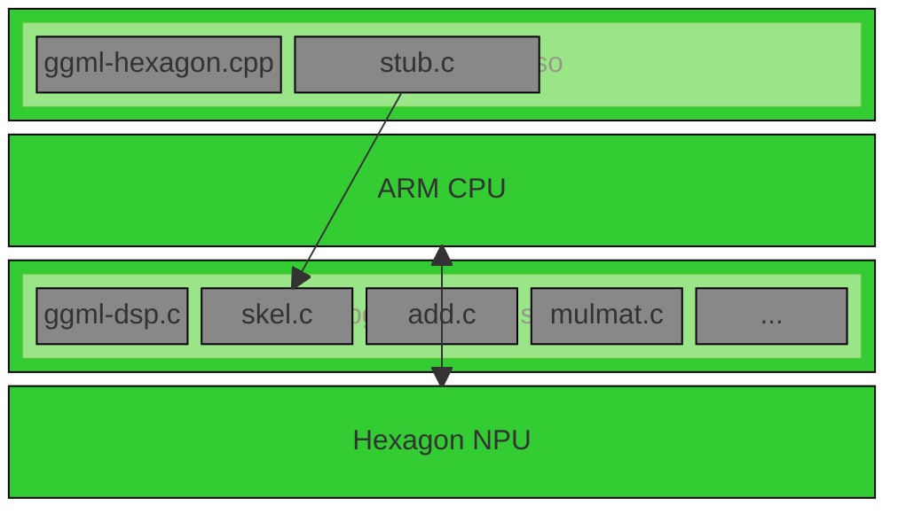

# Awesome-LLM-Inference-On-Android

##  Introduction

Focus on LLM inference on Android Phone/Pad/TV/STB/PC/Phone/Pad/TV/STB/PC/Intelligent Cockpit Domain in Electric Vehicle, especially Android phone equipped with Qualcomm Snapdragon high-end mobile SoC, such as Snapdragon 8Gen3, 8Elite, 8Elite2(might-be released on 09/2025 or 10/2025)....

Maintain an up-to-date Github repo to track the latest development of fundamental technologies, state-of-the-art on-device LLM models, Android APPs, future directions in this rapidly evolving field.

All content here is personal perspective from a full stack Android programmer and a highly-skilled FFmpeg programmer whom don't know hard-core AI tech(so the point of views might be different from professional AI researchers/experts/scientists).

##  Table of Contents

- [Awesome-LLM-Inference-On-Android](#awesome-llm-inference-on-android)
  - [Part 1: Research Papers](#part-1-research-papers)
  - [Part 2: On-Device Inference framework](#part-2-on-device-inference-framework)
  - [Part 3: Hardware acceleration](#part-3-hardware-acceleration)
  - [Part 4: LLama.cpp based Android APPs](#part-4-llamacpp-based-android-apps)
  - [Part 5: State-of-the-art on-device LLM models](#part-5-state-of-the-art-on-device-llm-models)
  - [Part 6: Mobile SoC References](#part-6-mobile-soc-references)
  - [Part 7: Acknowledgement](#part-7-acknowledgement)

## Part 1: Research Papers
### on-device inference
* HeteroLLM: Accelerating Large Language Model Inference on Mobile SoCs platform with Heterogeneous AI Accelerators  [[Paper]](https://arxiv.org/abs/2501.14794) 
* LLM prefilling with mllm-NPU [[Paper]](https://arxiv.org/abs/2407.05858v1)  , https://github.com/UbiquitousLearning/mllm
* PowerInfer-2: Fast Large Language Model Inference on a Smartphone  [[Paper]](https://arxiv.org/abs/2406.06282)  , https://github.com/SJTU-IPADS/PowerInfer
* T-MAC: CPU Renaissance via Table Lookup for Low-Bit LLM Deployment on Edge  [[Paper]](https://arxiv.org/abs/2407.00088v1)  , https://github.com/microsoft/T-MAC
* MobileNetV4 -- Universal Models for the Mobile Ecosystem  [[Paper]](https://arxiv.org/abs/2404.10518) 
* TinyLlama: An Open-Source Small Language Model  [[Paper]](https://arxiv.org/abs/2401.02385) 

### core technologies
* DeepSeek-R1: Incentivizing Reasoning Capability in LLMs via Reinforcement Learning  [[Paper]](https://arxiv.org/abs/2501.12948) 
* Efficient Memory Management for Large Language Model Serving with PagedAttention [[Paper]](https://arxiv.org/abs/2309.06180) 
* Mamba: Linear-Time Sequence Modeling with Selective State Spaces [[Paper]](https://arxiv.org/abs/2312.00752) 
* QLoRA: Efficient Finetuning of Quantized LLMs [[Paper]](https://arxiv.org/abs/2305.14314) 
* GPT-4 Technical Report [[Paper]](https://arxiv.org/abs/2303.08774) 
* LLaMA: Open and Efficient Foundation Language Models [[Paper]](https://arxiv.org/abs/2302.13971) 
* FlashAttention: Fast and Memory-Efficient Exact Attention with IO-Awareness [[Paper]](https://arxiv.org/abs/2205.14135) 
* Training language models to follow instructions with human feedback  [[Paper]](https://arxiv.org/abs/2203.02155)  
* Deep Reinforcement Learning from Human Preferences  [[Paper]](https://arxiv.org/abs/1706.03762) 
* Distilling the Knowledge in a Neural Network  [[Paper]](https://arxiv.org/abs/1503.02531) 

### fundamental technologies
* Attention Is All You Need  [[Paper]](https://arxiv.org/abs/1706.03741) 
* Deep Residual Learning for Image Recognition  [[Paper]](https://arxiv.org/abs/1512.03385) 
* Sequence to Sequence Learning with Neural Networks  [[Paper]](https://arxiv.org/abs/1409.3215) 
* Efficient Estimation of Word Representations in Vector Space  [[Paper]](https://arxiv.org/abs/1301.3781) 
* ImageNet Classification with Deep Convolutional Neural Networks  [[Paper]](https://proceedings.neurips.cc/paper_files/paper/2012/file/c399862d3b9d6b76c8436e924a68c45b-Paper.pdf) 

## Part 2: On-Device Inference framework

* https://github.com/ggml-org/llama.cpp
* https://github.com/mlc-ai/mlc-llm
* https://github.com/alibaba/MNN
* https://github.com/Tencent/ncnn
* https://github.com/XiaoMi/mace
* https://github.com/OpenPPL/ppl.nn
* https://github.com/pytorch/executorch
* https://github.com/google-ai-edge/LiteRT
* https://github.com/microsoft/onnxruntime
* https://github.com/Samsung/ONE
* https://github.com/mindspore-ai/mindspore 

## Part 3: Hardware acceleration

### QNN solution
aka End-to-End solution, which is similar to the Qualcomm's official AI-Hub solution.

Fig-1: cited from Qualcomm's QNN SDK Manual

QNN solution based fully/semi open source projects:
  - https://github.com/SJTU-IPADS/PowerInfer
  - https://github.com/UbiquitousLearning/mllm
  - https://github.com/MollySophia/rwkv-qualcomm
  - https://github.com/XiaoMi/StableDiffusionOnDevice
  - https://github.com/powerserve-project/PowerServe

### llama.cpp solution

a specified ggml backend for llama.cpp on Android. Theoretically speaking, model preparation/conversion **is not needed** in this solution, which **is exactly similar to  ggml-cuda,ggml-metal,ggml-sycl**.

Fig-2: cited from Qualcomm's Hexagon SDK Programmers_Reference_Manual

libggml-hexagons.so(running on ARM CPU side):  ggml-hexagon.cpp + stub.c

libggmldsp_skel.so(running on DSP side): ggmldsp.c + skel.c + add.c + mulmat.c + ... ( developers and AI experts can operate hardware directly on DSP side)

Fig-3: self-made

llama.cpp solution based open source projects:
  - https://github.com/zhouwg/ggml-hexagon, the first original llama.cpp solution which launched on 03/2024(the initial version was reverse engineered from [Qualcomm's codes in executorch](https://github.com/pytorch/executorch/tree/main/backends/qualcomm)), this llama.cpp-based solution is a simple, concise, easy-to-extend, easy-to-troubleshoot, easty-to-maintain solution.
  - https://github.com/chraac/llama.cpp (hard-forked from zhouwg's initial version)

## Part 4: LLamacpp based Android APPs
llama.cpp based Androd APPs
* https://github.com/a-ghorbani/pocketpal-ai
* https://github.com/Vali-98/ChatterUI
* https://github.com/shubham0204/SmolChat-Android
* https://github.com/kantv-ai/kantv (this is an on-device AI learning&hobby project, focus on Android phone)

## Part 5: State-of-the-art on-device LLM models

Google gemma-3n:
* gemma-3n-E4B-it-litert-preview: https://huggingface.co/google/gemma-3n-E4B-it-litert-preview
* gemma-3n-E2B-it: https://huggingface.co/google/gemma-3n-E2B-it
* gemma-3n-E4B-it: https://huggingface.co/google/gemma-3n-E4B-it
* gemma-3n-E2B-it GGUF model: https://huggingface.co/ggml-org/gemma-3n-E2B-it-GGUF/tree/main (verified on Snapdragon 8Elite and 8Gen3, speed in 8Elite is good, speed in 8Gen3 is not good)
* gemma-3n-E4B-it GGUF model: https://huggingface.co/ggml-org/gemma-3n-E4B-it-GGUF/tree/main

HuggingFace SmolVLM:
* SmolVLM-256M-Instruct:https://huggingface.co/HuggingFaceTB/SmolVLM2-256M-Video-Instruct
* SmolVLM-256M-Instruct GGUF model: https://huggingface.co/ggml-org/SmolVLM2-256M-Video-Instruct-GGUF/tree/main (verified on Snapdragon 8Gen3 and Snapdragon 8Elite, unbelieveable experience on Android phone)

## Part 6: Mobile SoC References
* Qualcomm: https://docs.qualcomm.com/bundle/publicresource/topics/80-63442-50/introduction.html
* MTK: https://neuropilot.mediatek.com/resources/public/npexpress/en/docs/npexpress
* [Samsung Exynos](https://en.wikipedia.org/wiki/Exynos): TBD
* [Huawei Hisilicon](https://en.wikipedia.org/wiki/HiSilicon): TBD
* [UniSoC](https://en.wikipedia.org/wiki/UNISOC): TBD
* [Xiaomi Xuanjie](https://en.wikipedia.org/wiki/Xiaomi): TBD
* [Google Tensor](https://en.wikipedia.org/wiki/Google_Tensor): TBD

## Part 7: Acknowledgement

 <ul>AI inference framework

   <ul>
  <li>
   <a href="https://github.com/ggml-org/ggml">GGML</a>(as a full-stack Android programmer and a highly-skilled FFmpeg programmer whom believe the philosophy of <b>"simple is beautiful"</b> which comes from the great Unix, I personally/always think it's another FFmpeg since 03/2024 and I like it very much although there are many AI inference frameworks from big IT tech giants)
   </li>

  </ul>

  </ul>

 <ul>AI application engine

  <ul>
  <li>
   ASR engine <a href="https://github.com/ggml-org/whisper.cpp">whisper.cpp</a>
  </li>

   <li>
  LLM engine <a href="https://github.com/ggml-org/llama.cpp">llama.cpp</a>
  </li>

 
  <li>
   CV engine <a href="https://github.com/nihui/opencv-mobile">opencv-mobile</a>
  </li>

  <li>
   MTMD(multimodal) engine <a href="https://github.com/ggml-org/llama.cpp/blob/master/tools/mtmd/README.md">MTMD subsystem in llama.cpp</a>
  </li>

  </ul>

  </ul>

  <ul>References
  <ul>
    <li>https://mp.weixin.qq.com/s/1lUSlc0tvEWLuOFOP0WkUA (zh)</li>
    <li>https://github.com/ngxson/smolvlm-realtime-webcam</li>
  </ul>
</ul>
